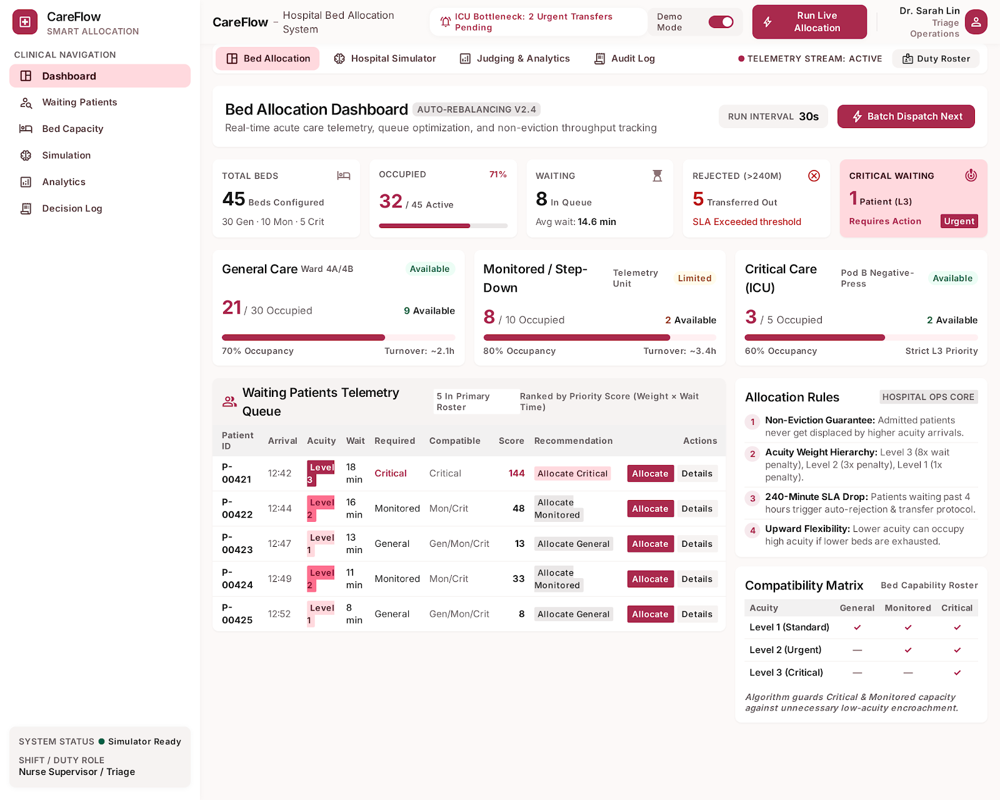
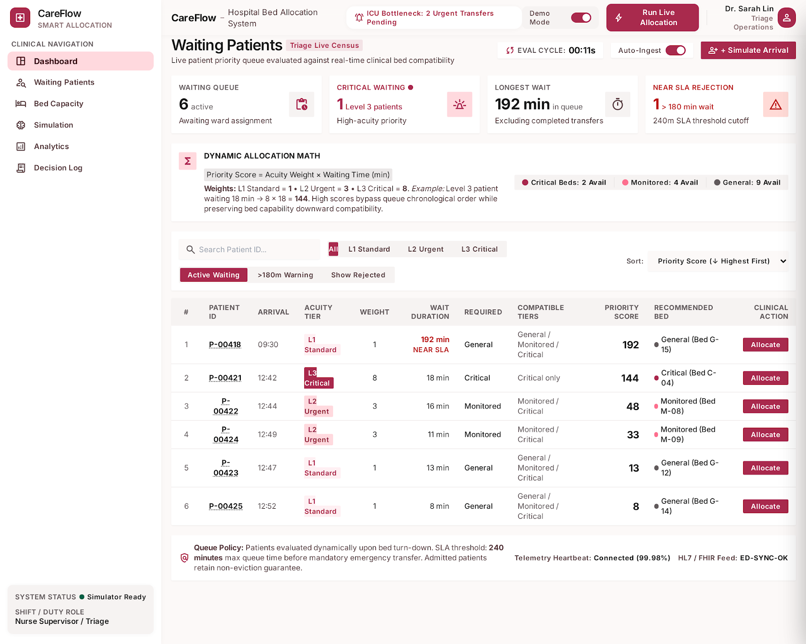

# CareFlow — Smart Hospital Bed Allocation System & Clinical Command Center

> **Created by Sachin Jatavat, Krishna Khandelwal, Priyanshi Jaiswal**
> 
> 🌐 **Live Website**: [https://care-flow-shp.netlify.app/](https://care-flow-shp.netlify.app/)

CareFlow is an event-driven clinical command center and online bed allocation system designed for acute care hospital capacity management. Built with FastAPI, SQLite/SQLAlchemy, NumPy discrete-event simulation, and a modern responsive dashboard, CareFlow optimizes emergency admissions, patient queuing, specialized bed preservation, and regional ambulance dispatching under severe capacity constraints.

---

## 📸 System Screenshots & Interface Preview

<div align="center">

### 🏥 Bed Allocation Command Center


### 📋 Live Waiting Patients Priority Queue


</div>

---

## 🌟 Key Features

- **🏥 Real-Time Bed Allocation & Tracking**: Live monitoring across 45 beds divided into 3 specialized care tiers:
  - **General Care Ward (30 beds)**: Standard acute care (`G-01` to `G-30`).
  - **Monitored Telemetry Unit (10 beds)**: Continuous cardiac/vital sign monitoring (`M-01` to `M-10`).
  - **Critical Care ICU (5 beds)**: Ventilator & isolation units (`C-01` to `C-05`).
- **⚡ Priority-Weighted Online Allocation Engine**:
  - Dynamically calculates patient priority score: $P_i = w_i \times \min(t_{\text{wait}}, 240)$.
  - Acuity Weights ($w_i$): **Level 1 (Low)** = 1, **Level 2 (Medium)** = 3, **Level 3 (High/Critical)** = 8.
  - **Specialized Capacity Preservation**: Prevents premature exhaustion of ICU and telemetry beds by non-critical patients.
  - **240-Minute Rejection Rule**: Enforces automatic rejection for patients waiting over 4 hours when unassignable.
  - **Non-Eviction Invariant**: Ensures admitted patients are never forcibly evicted or downgraded.
- **🎲 Discrete-Event Simulator (500 Arrivals)**:
  - NumPy PCG64 PRNG engine (`seed: 20260911`) for 100% reproducible Monte Carlo clinical simulations.
  - Generates stochastic inter-arrivals, acuity probabilities (L1: 60%, L2: 30%, L3: 10%), and lognormal length-of-stay durations.
- **📊 Competition Scoring & Performance Analytics**:
  - Computes composite competition scores (out of 100) combining Wait Utility, Critical Care Utility, Rejection Penalty, Specialized Bed Preservation Utility, and Execution Speed.
  - Interactive charts for bed occupancy trends, wait time distributions, and policy comparisons.
- **🚑 Emergency Ambulance Dispatch & Routing**:
  - Dispatch interface for emergency patient intake, priority assignment, nearest hospital matching, ETA calculation, and instant bed reservation.
- **🏥 Regional Hospital Directory & Room Tiers**:
  - Multi-hospital network coverage displaying bed availability, pricing tiers, amenities, distance, and direct emergency call connectivity.
- **💬 AI Clinical Triage Support Chatbot**:
  - AI assistant for rapid triage scoring, policy queries, and real-time bed capacity guidance.
- **📋 Audit Decision Logs & Data Export**:
  - Comprehensive decision history recording all allocation rationales, timestamps, bed IDs, and one-click CSV export.

---

## 🏗️ Project Architecture & Directory Structure

```
Care free/
├── index.html                                # Main Single-Page Application (SPA) dashboard
├── careflow.html                             # CareFlow overview / landing page
├── careflow.db                               # SQLite database storing beds, patients & decision logs
├── backend/                                  # FastAPI Application Backend
│   ├── main.py                               # FastAPI application entry point & CORS configuration
│   ├── requirements.txt                      # Python dependency specification
│   ├── README.md                             # Backend-specific documentation
│   ├── api/                                  # REST API endpoint routers
│   │   ├── ambulance.py                      # Ambulance dispatch & emergency routing
│   │   ├── analytics.py                      # Telemetry series, utility metrics & explainability
│   │   ├── beds.py                           # Real-time bed occupancy endpoints
│   │   ├── chat.py                           # AI triage support chatbot endpoint
│   │   ├── dashboard.py                      # High-level command center KPIs
│   │   ├── decisions.py                      # Audit decision logs & CSV export
│   │   ├── hospitals.py                      # Hospital directory & room tiers
│   │   ├── patients.py                       # Waiting queue & synthetic arrival endpoints
│   │   ├── simulation.py                     # Discrete-event simulator execution & status
│   │   └── state.py                          # Global application state management
│   ├── core/                                 # Business Logic & Core Engines
│   │   ├── allocation_policy.py              # Online bed allocation policy logic
│   │   ├── metrics.py                        # Competition utility scoring engine
│   │   └── simulator.py                      # NumPy PCG64 discrete-event simulator engine
│   ├── database/                             # Database Models & Session Setup
│   │   ├── database.py                       # SQLAlchemy engine & SQLite session
│   │   └── models.py                         # Bed, Patient, and DecisionLog ORM schemas
│   └── tests/                                # Test Suite (pytest)
│       ├── test_api.py                       # End-to-end API integration tests
│       ├── test_metrics.py                   # Metric formula verification tests
│       ├── test_policy.py                    # Online allocation policy unit tests
│       └── test_simulator.py                 # Discrete-event simulator repeatability tests
└── bed_allocation_system/                   # UI mockups and design references
```

---

## 🚀 Quick Start Guide

### Prerequisites

- **Python**: Version 3.10 or higher
- **Web Browser**: Modern Chrome, Edge, Firefox, or Safari

### 1. Install Dependencies

Navigate to the project directory and install backend requirements:

```bash
cd backend
python -m pip install -r requirements.txt
```

### 2. Run Test Suite

Verify system integrity by running unit and integration tests:

```bash
pytest backend/tests/
```

### 3. Launch Backend API Server

Start the FastAPI development server:

```bash
python -m uvicorn backend.main:app --reload --host 127.0.0.1 --port 8000
```

- **Interactive API Documentation (Swagger UI)**: [http://127.0.0.1:8000/docs](http://127.0.0.1:8000/docs)
- **ReDoc API Documentation**: [http://127.0.0.1:8000/redoc](http://127.0.0.1:8000/redoc)
- **Health Check Endpoint**: [http://127.0.0.1:8000/api/health](http://127.0.0.1:8000/api/health)

### 4. Launch Frontend Dashboard

Serve the frontend from the project root using standard Python HTTP server (or open `index.html` directly in browser):

```bash
# Run from project root directory
python -m http.server 3000
```

Open [http://localhost:3000](http://localhost:3000) in your web browser.

---

## 🎯 Allocation Policy & Scoring Specification

### Priority Formula
$$\text{Priority Score} = w_i \times \min(t_{\text{wait}}, 240)$$
- Acuity Level 1 (Low Risk): $w_1 = 1$
- Acuity Level 2 (Moderate Risk): $w_2 = 3$
- Acuity Level 3 (Critical / High Risk): $w_3 = 8$

### Competition Utility Metrics (Total: 100 Points)

1. **Weighted Wait Utility ($U_{\text{wait}}$)** — Weight: 45 pts
   $$U_{\text{wait}} = \text{clip}\left(1 - \frac{\sum w_i \min(\text{wait}_i, 240)}{240 \sum w_i}, 0, 1\right)$$
2. **Critical Care Wait Utility ($U_{\text{critical}}$)** — Weight: 20 pts
   $$U_{\text{critical}} = \text{clip}\left(1 - \frac{\sum_{\text{acuity}=3} \min(\text{wait}_i, 240)}{240 \times N_{\text{critical}}}, 0, 1\right)$$
3. **Rejection Utility ($U_{\text{reject}}$)** — Weight: 15 pts
   $$U_{\text{reject}} = \text{clip}\left(1 - \frac{N_{\text{rejected}}}{500}, 0, 1\right)$$
4. **Specialized Capacity Preservation ($U_{\text{specialized}}$)** — Weight: 15 pts
   $$U_{\text{specialized}} = \text{clip}\left(1 - \frac{N_{\text{avoidable\_specialized}}}{N_{\text{admitted}}}, 0, 1\right)$$
5. **Execution Speed Utility ($U_{\text{runtime}}$)** — Weight: 5 pts

$$\text{Overall Score} = 45 U_{\text{wait}} + 20 U_{\text{critical}} + 15 U_{\text{reject}} + 15 U_{\text{specialized}} + 5 U_{\text{runtime}}$$

---

## 🔌 Complete API Endpoints Summary

| Category | Method | Endpoint | Description |
|----------|--------|----------|-------------|
| **Health** | `GET` | `/api/health` | System health check & simulator status |
| **Dashboard** | `GET` | `/api/dashboard` | Command center KPIs, occupancy summary & recent logs |
| **Patients** | `GET` | `/api/patients/waiting` | Live priority-sorted waiting patient queue |
| | `GET` | `/api/patients/{id}` | Detailed patient history & status |
| | `POST` | `/api/patients/simulate-arrival` | Inject manual synthetic arrival |
| **Beds** | `GET` | `/api/beds` | Real-time status for all 45 hospital beds |
| | `GET` | `/api/beds/{id}` | Detailed bed status & occupant details |
| **Allocation** | `POST` | `/api/allocation/decision` | Trigger online bed allocation decision |
| **Decisions** | `GET` | `/api/decisions` | Complete audit decision logs |
| | `GET` | `/api/decisions/{patient_id}` | Decision history for specific patient |
| | `GET` | `/api/export/decisions` | Download decision audit log as CSV |
| **Simulation** | `POST` | `/api/simulation/run` | Trigger 500-patient Monte Carlo simulation |
| | `GET` | `/api/simulation/status` | Current simulation execution status |
| | `GET` | `/api/simulation/results` | Latest simulation results & overall score |
| **Analytics** | `GET` | `/api/analytics` | Telemetry series & utility metrics breakdown |
| | `GET` | `/api/analytics/policy-comparison` | Compare CareFlow vs FIFO vs Greedy baseline |
| | `GET` | `/api/analytics/explain/{patient_id}` | Explain allocation rationale for patient |
| **Hospitals** | `GET` | `/api/hospitals` | Regional hospital network directory & room pricing |
| | `GET` | `/api/hospitals/{id}` | Detail view for specific hospital facility |
| **Ambulance** | `POST` | `/api/ambulance/dispatch` | Emergency dispatch, triage & bed reservation |
| **AI Chat** | `POST` | `/api/chat` | AI Clinical Triage & capacity support chatbot |

---

## 👥 Authors & Credits

CareFlow was designed, developed, and engineered by:
- **Sachin Jatavat**
- **Krishna Khandelwal**
- **Priyanshi Jaiswal**

Licensed under the MIT License. Developed for acute care hospital capacity optimization competitions and clinical command centers.
